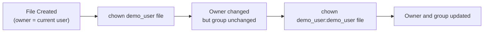

<!---
{
  "id": "bccc53a1-ca6e-4995-8ce9-10958bf9e1f9",
  "teaches": "Creating Users, Managing Groups, and Basic Ownership in *NIX Systems",
  "depends_on": [
    "be5c2a4a-756f-4303-961c-e616e0cdab11"
  ],
  "author": "Stephan Bökelmann",
  "first_used": "2025-12-05",
  "keywords": ["linux", "adduser", "sudo", "groups", "chown", "permissions"]
}
--->

# Creating Users, Managing Groups, and Basic Ownership in *NIX Systems

> In this exercise you will learn how to create new users, grant administrative privileges with `sudo`, assign users to groups, and change file ownership using `chown`. Furthermore, we will explore how these concepts interact with the basic permission model that you will study more deeply in a later exercise.

## 1) Introduction

User and group management is a core responsibility of any system administrator, and even everyday Linux users frequently encounter situations where these concepts matter. While earlier exercises introduced you to the ideas of users, groups, and permissions, this exercise advances your understanding by guiding you through practical system-level operations. You will create new accounts, adjust their group memberships, control whether they can perform administrative tasks, and manipulate which user or group owns a given file.

On Unix-like systems, the **`adduser`** (or sometimes lower-level `useradd`) command creates a new user. Depending on the distribution, `adduser` is a more user-friendly frontend that creates a home directory, sets permissions, and guides you through assigning a password. Newly created users normally start with limited permissions, which reinforces the principle of least privilege. To temporarily grant administrative rights, systems rely on **`sudo`**, which securely elevates commands executed by a regular user to superuser privileges after authentication.

Groups provide a mechanism for collaborative permission management. Adding a user to a group—whether existing ones such as `sudo`/`wheel`, or custom groups you create—enables shared access to files or capabilities without giving full superuser rights. The `usermod` command allows you to modify these associations.

Files in Unix-like systems always have an **owner** and an associated **group**, and these two attributes determine how permission bits are interpreted. The command **`chown`** (change owner) is fundamental for adjusting ownership, often necessary after administrative operations or when preparing shared project directories.

Throughout this exercise, you will rely on terminal commands you already know: navigating directories, editing files with `vim`, and inspecting filesystem information. These actions will reinforce your understanding of how Linux enforces security and collaboration at the filesystem level.

### 1.1) Further Readings and Other Sources
- The GNU Shadow Utilities Manual (user and group tools): https://www.gnu.org/software/shadow/manual/
- `man adduser`, `man usermod`, `man chown` — your system’s built-in documentation  
- YouTube: “Linux File Permissions and Ownership Explained” (NetworkChuck)  
- DOI: 10.1109/MC.2005.39 — “Understanding Unix Permissions” (introductory overview of security concepts)

## 2) Tasks

### 2.1) Create a New User

1. Ensure you are working on a system where you are allowed to create new users.  
2. Run:
   ```bash
   sudo adduser demo_user
   ```

Follow the prompts. The system will:

* Create `/home/demo_user`
* Assign default ownership and permissions
* Ask you to set a password
* Optionally request user metadata (this can be left blank)

3. Verify the user was created:

   ```bash
   getent passwd demo_user
   ```

### 2.2) Add the User to a Group

1. Check which groups currently exist:

   ```bash
   getent group
   ```

2. Add the new user to an existing group, for example `sudo` or `wheel` depending on your distribution:

   ```bash
   sudo usermod -aG sudo demo_user
   ```

3. Verify group membership:

   ```bash
   id demo_user
   ```

   You should now see `sudo` listed among the supplementary groups.
   *(Note: Membership changes usually take effect on the user's next login.)*

### 2.3) Test `sudo` Access for the New User

1. Switch to the new user:

   ```bash
   su - demo_user
   ```

2. Attempt to run:

   ```bash
   sudo ls /root
   ```

   The user should now be able to use `sudo` after entering their password.

3. Exit the session:

   ```bash
   exit
   ```

### 2.4) Working With File Ownership

1. Create a file as your normal user:

   ```bash
   echo "Hello ownership!" > sample.txt
   ls -l sample.txt
   ```

   Observe the owner and group.

2. Change the owner to the new user:

   ```bash
   sudo chown demo_user sample.txt
   ```

3. Verify the change:

   ```bash
   ls -l sample.txt
   ```

4. Change both owner **and** group at once:

   ```bash
   sudo chown demo_user:demo_user sample.txt
   ls -l sample.txt
   ```

### 2.5) Exercise Diagram (Ownership Flow)



## 3) Questions

1. What is the functional difference between `adduser` and `useradd` on most Linux distributions?
2. Why is it safer to add users to groups like `sudo` rather than letting everyone use the root account directly?
3. What does the `-aG` combination in `usermod -aG` achieve?
4. How does `sudo` determine which users may execute privileged commands?
5. After running `chown demo_user file.txt`, why might the group not change?
6. What is the effect of running `chown alice:developers project/` compared to only changing the owner?
7. Why must you usually log out and back in for group membership changes to apply?

## 4) Advice

When working with users, groups, and ownership, always remember that you are interacting with some of the most security-sensitive components of a Unix-like system. It is natural to feel cautious or unsure at first. Take your time, verify your commands, and do not hesitate to double-check with `id`, `ls -l`, or relevant `man` pages. As exercises progress, you will learn more about permission bits and how they complement the concepts introduced here. Consistent practice will make these operations feel intuitive, and soon you will be able to administer multi-user environments confidently.